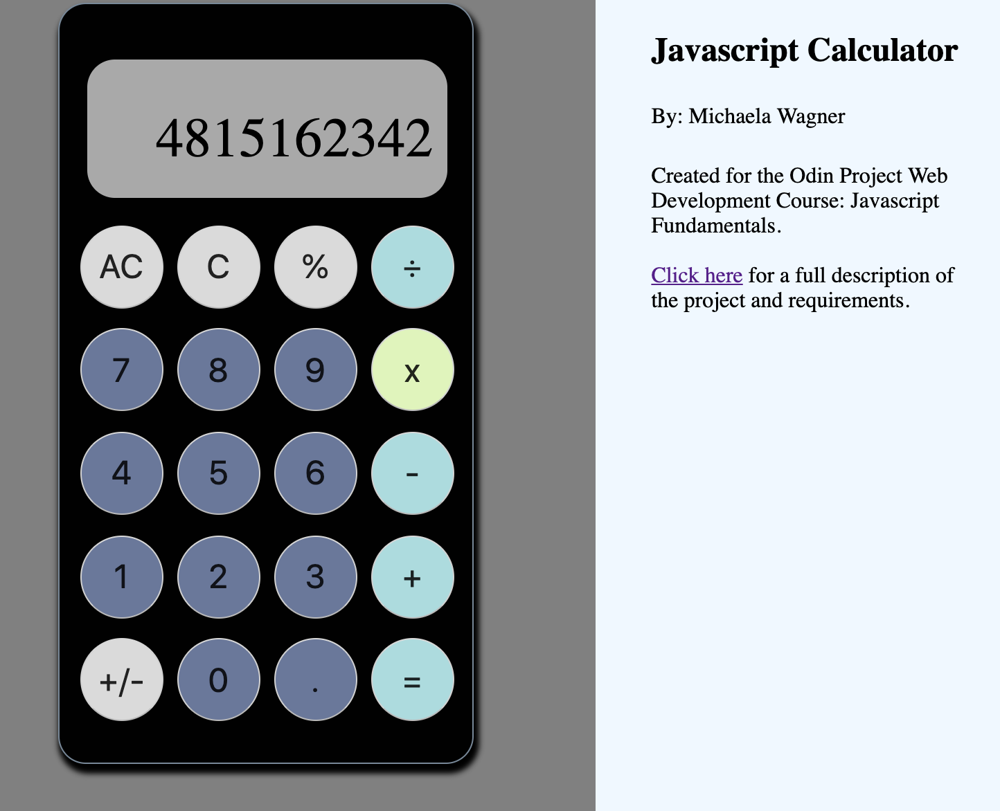

<h1>Simple Javascript Calculator</h1>

Created for Odin Project Web Development Course: Javascript Fundamentals

Check out the project brief<a href="https://www.theodinproject.com/lessons/calculator">here.</a>

<ol>
<li>Javascript, HTML, CSS</li>
<li>Calculator operations include addition, subtraction, multiplication, and division</li>
</ol>

